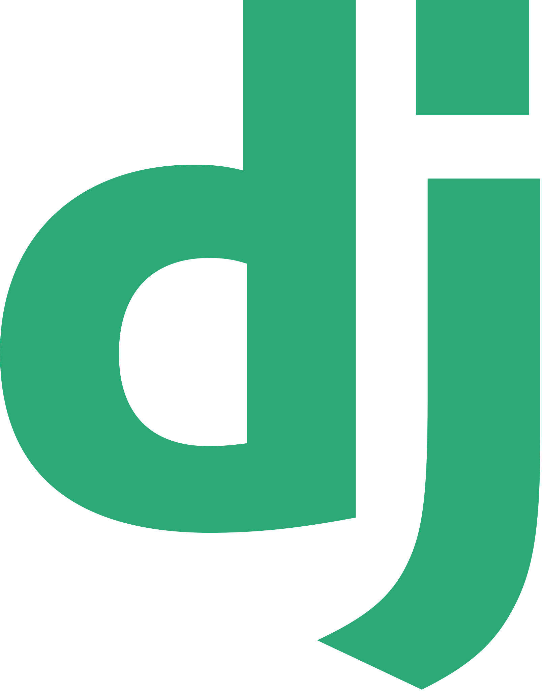
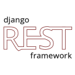
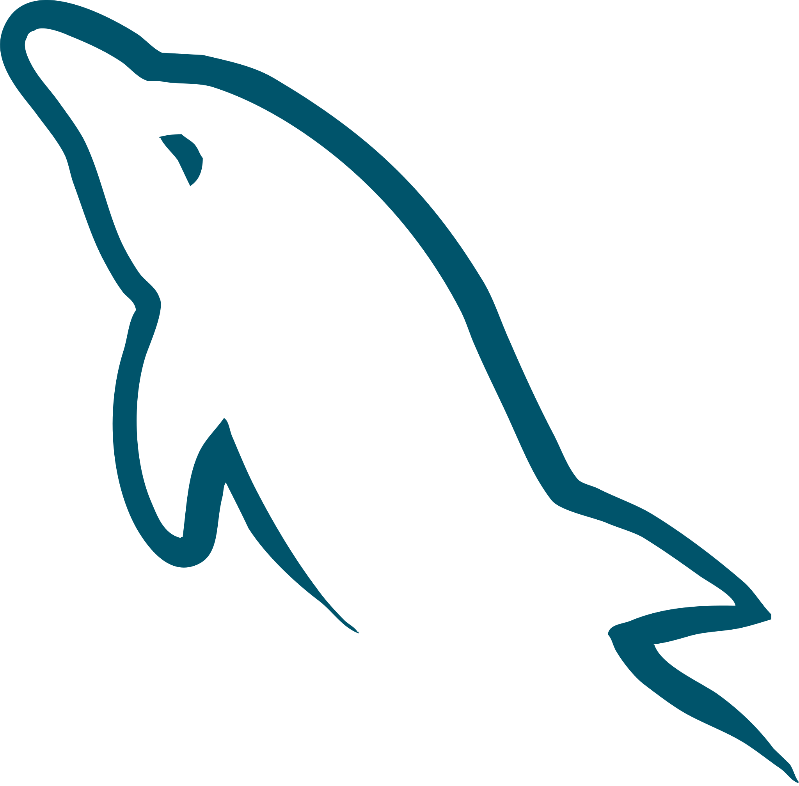
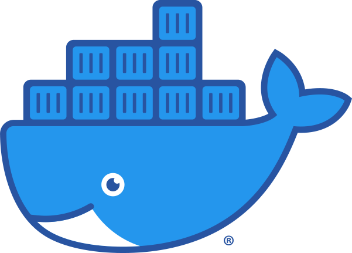

  
  
  

---

## About Me

I’m a learner and aspiring backend developer with a background in mechanical engineering, now diving into software engineering. I’m progressing through the [ALX Africa Software Engineering Program: ProDev BackEnd Web Development](https://www.alxafrica.com/wp-content/uploads/2024/11/ProDev-Back-End-Catalogue_compressed.pdf), building my skills step by step.

I’m passionate about understanding backend systems, solving problems, and learning new tools. Curiosity and turning ideas into working code drive me forward.

---

  

## Tech Stack & Tools

| Python | Django | DRF | Swagger | MySQL | PostgreSQL |
|--------|--------|-----|--------|-------|------------|
|  |  |  |  |  |  |

| SQLite | PyTest | Git | GitHub | Docker |
|--------|-------|-----|--------|-------|
|  |  |  |  |  |

| Linux CLI | Bash | Kubernetes |
|-----------|------|------------|
|  |  |  |

---
## Projects I'm Proud Of

<table align="center">
<tr>
<td valign="top">

### [Library Management System API](https://github.com/cephastay/library_management_api)
A RESTful API for managing a digital library:
- 📚 Manage books, users, borrow/return transactions
- ⏰ Track overdue items automatically
- 🔒 Secure authentication using JWT

**Demo:** [Loom Video Walkthrough](https://www.loom.com/share/6e613415d0974fcfb2f1c9feebfa0cb0?sid=e19a994b-77c1-49f5-a9b2-ffe0b1e0a290)  
**Built with:** Django, DRF, MySQL, JWT, Swagger  
**Learned:** JWT authentication, relational DB design, clean REST APIs

</td>
<td valign="top">

### [Inventory Management System](https://github.com/enamyaovi/Python_SQL_Db.git)
A Python & MySQL program for managing product inventory:
- 🛠️ Manages MySQL database connections
- 📦 CRUD operations: add, update, delete, view products
- ⚡ Stock alerts for low inventory
- 🧰 Command-line interface for easy interaction
- 🔄 Sorts and searches products

**Built with:** Python, MySQL, mysql.connector  
**Learned:** CRUD logic, MySQL connections, CLI interfaces, error handling

</td>
</tr>
</table>

---

## 🎯 Goals

<table align="center">
<tr>
<th>Goal</th>
<th>Progress</th>
</tr>
<tr>
<td>🔧 Strengthen backend & DevOps skills</td>
<td>55%</td>
</tr>
<tr>
<td>🧳 Backend internship by Dec 2025</td>
<td>10%</td>
</tr>
<tr>
<td>🤝 Contribute to open-source projects</td>
<td>5%</td>
</tr>
<tr>
<td>🧱 Master CI/CD and containerization</td>
<td>20%</td>
</tr>
</table>

---

## 📫 Let's Connect

<table align="center">
<tr>
<td>

</td>
<td>

</td>
</tr>
</table>

---

## ⚡ Fun Fact

I’m a huge fan of manga and anime, especially **Berserk** and **Kingdom**. Their themes of resilience and growth inspire my coding journey.

---

|  |  |  |
|--|--|--|
|  |  |  |
| GitHub Stats | Top Languages | Streak Stats |

---

  

Icons used in this project are from [dheereshagrwal's GitHub repo](https://github.com/dheereshagrwal/coloured-icons).

